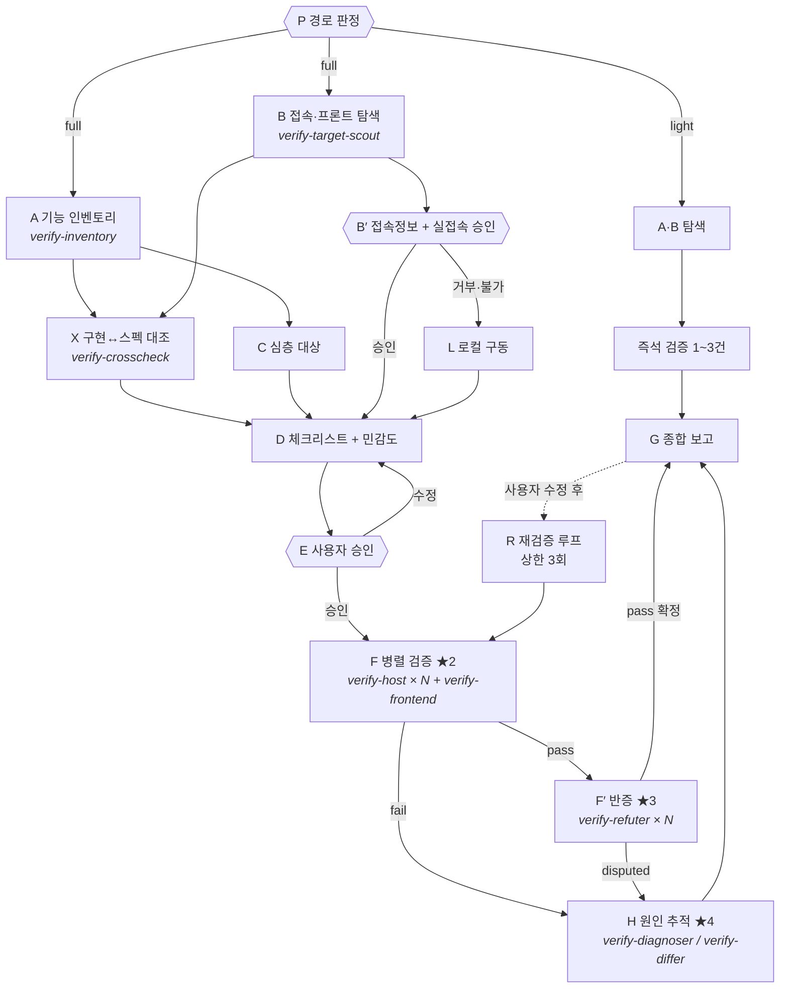

# verify-impl

기능 파악 → 접속 대상 확보 → **실접속 승인** → 체크리스트 + 민감도 → **사용자 승인** → 호스트별 병렬 실증 → 적대적 교차검증 → 보고.

## 팀 구성

팀장(이 skill)은 오케스트레이션만 한다. 실제 탐색과 실행은 팀원이 한다.

| 팀원 | 담당 | 왜 분리하나 |
|------|------|-------------|
| `verify-inventory` | A - 기능 인벤토리 | 코드를 대량으로 읽어도 팀장 컨텍스트에 안 쌓인다 |
| `verify-target-scout` | B - 접속 대상·프론트 탐색 | A와 독립이라 동시 실행 가능 |
| `verify-crosscheck` | X - 구현↔스펙 대조 | A·B 결과만 있으면 되고 C와 병렬로 돈다 |
| `verify-host` | F - 호스트 한 대 전담 검증 | 로그 수천 줄이 팀원에서 끝나고 팀장엔 JSON 만 온다 |
| `verify-frontend` | F - 프론트↔백엔드 연계 | 계약 불일치는 양쪽을 같이 봐야 잡힌다 |
| `verify-refuter` | F′ - 반증 전담 | 팀장과 분리돼야 확증 편향이 안 생긴다 |
| `verify-diagnoser` | H - fail 원인 추적 | 실패 하나를 깊게 파는 일이라 항목별로 나뉜다 |
| `verify-differ` | H - 호스트 간 차이 원인 | 같은 코드가 다르게 도는 건 환경 문제다. 대조가 전문 기술 |

팀원 정의는 `~/.claude/agents/verify-*.md` 에 있다.

**팀장이 직접 하는 것:** 사람과의 대화(B′ 접속 승인, E 체크리스트 승인), 판단(C 심층 대상, D 체크리스트·민감도), 종합(G).
**팀장이 하지 않는 것:** 코드 통독, SSH 접속, 검증 명령 실행, 반증.

## 절대 규칙

1. **추정을 사실로 말하지 않는다.** "~일 것이다", "~로 보인다"로 판정하지 않는다. 실제로 붙어서 본 것, 실행한 명령의 출력, `file:line` 중 하나가 없으면 verdict는 `unknown`이다. 코드가 그렇게 쓰여 있다는 것과 그렇게 동작한다는 것은 다른 주장이다.
2. **실제 노드에 붙기 전에 반드시 묻는다.** 접속 자체가 승인 대상이다. 거부되면 로컬 구동(L)으로 간다.
3. **E 승인 없이 F로 넘어가지 않는다.** 체크리스트를 제시할 때 **민감 항목을 미리 짚어서** 함께 묻는다 - 사용자가 하나씩 찾아내게 하지 않는다.
4. **범위를 넘지 않는다.** 지시받은 대상 밖의 코드·파일·호스트·브랜치를 건드리지 않는다. 부수적으로 고칠 게 보이면 **보고만 하고 하지 않는다.**
5. **비밀번호·토큰은 세션 안에서만 기억한다.** 파일에 쓰지 않고, 출력에서는 마스킹한다.

## 실행 그래프

| # | 노드 | 담당 | 의존 | 병렬군 | 게이트(통과조건) |
|---|------|------|------|--------|------------------|
| P | **경량/전체 경로 판정** | **팀장** | - | - | 경로 확정. 애매하면 한 줄 질문 |
| A | 기능 인벤토리 | `verify-inventory` | P | ★1 | 기능별 `file:line` 근거 |
| B | 접속 대상 · 프론트 탐색 | `verify-target-scout` | P | ★1 | 호스트 후보 + 프론트 유무 |
| X | 구현↔스펙 대조 | `verify-crosscheck` | A, B | ★1.5 | 미구현·미문서화·계약불일치 목록 |
| C | 심층 검토 대상 판정 | **팀장** | A | ★1.5 | 우선순위 + 이유 |
| B′ | **접속 정보 질의 + 실접속 승인** | **팀장** | B | - | 블로킹. 승인/거부 확정 |
| L | **로컬 구동** (실접속 거부·불가 시) | 팀장 | B′ | - | 헬스체크 통과해야 F 가능 |
| D | 체크리스트 + **민감도 표시** | **팀장** | X, C, B′\|L | - | 배리어. 항목별 방법·기준·민감도 |
| E | **사용자 승인** (민감 항목 개별 확인) | **팀장** | D | - | 블로킹. 명시적 승인 |
| F | 실증 검증 | `verify-host` × 호스트<br>`verify-frontend` × 1 | E | ★2 | 항목별 verdict + evidence |
| F′ | 적대적 교차검증 | `verify-refuter` × pass 수 | F의 pass | ★3 | 반증 실패해야 최종 pass |
| H | **원인 추적** | `verify-diagnoser` × fail 수<br>`verify-differ` × 차이 항목 | F, F′ | ★4 | 원인 + 근거 + 수정안(실행 안 함) |
| R | **재검증 루프** | 팀장 → F 재호출 | 사용자 수정 후 | - | fail 0 또는 상한 3회 |
| G | 종합 보고 | **팀장** | F, F′, H | - | 배리어 |

**P 가 `light` 면 A·B → 즉석 검증 → 보고 로 끝낸다.** 판정표 → `references/routing.md`
**팀장은 직접 검증하지 않는다.** 탐색·실행·반증·진단은 팀원에게 위임하고, 팀장은 사람과의 대화(P·B′·E), 판단(C·D), 종합(G)만 한다.
팀원은 컨텍스트가 격리돼 있어 로그 수천 줄을 읽어도 팀장에게는 정리된 결과만 올라온다.



★1 = A·B 동시 · ★2 = **호스트별** Agent 동시 · ★3 = pass 항목별 동시

---

## P. 경로 판정

**시작하자마자 판정한다.** 짧은 단발 확인에 풀코스를 돌리는 게 이 skill 의 가장 흔한 실패다.

- **전체 신호**(다중 요구 / "전부"·"전반적" / 대상 미특정 / 호스트 2개 이상 / 배포 동반 / 200자 초과) 가 **하나라도** 있으면 `full`
- 전체 신호가 없고 짧은 단발 요청이면 `light`
- 애매하면 **한 줄로 묻는다**: "이거 하나만 빠르게 확인할까요, 아니면 관련 기능 전체를 검증할까요?"

`light` 경로: A·B 동시 → 대상 1~3개 즉석 검증 → 보고. **E 승인은 생략하되 B′ 실접속 승인은 생략하지 않는다.**
`light` 중 상태 변경이 필요해지거나 항목이 5개를 넘으면 **full 로 승격하고 알린다.** 반대로 강등하지는 않는다.

판정표와 승격 규칙 → `references/routing.md`

## A·B. 탐색 [★1 - 한 메시지에서 동시 호출]

**팀장이 직접 읽지 않는다.** 아래 둘을 한 메시지에서 동시에 띄운다.

| 팀원 | subagent_type | 넘길 것 |
|------|---------------|---------|
| 기능 인벤토리 | `verify-inventory` | repo 경로, 사용자가 지목한 관심 영역 |
| 접속 대상 탐색 | `verify-target-scout` | repo 경로 |

둘 다 돌아오면 배리어. `verify-target-scout` 가 `.claude/verify-targets.md` 를 찾았으면 **호스트를 재질문하지 않는다.**
판정 기준 상세 → `references/discovery.md`

## B′. 접속 정보 질의 + 실접속 승인 (블로킹)

**실제 노드에 붙는 것 자체를 먼저 묻는다.** 아래를 한 번에 묻고, 나눠서 여러 턴에 걸쳐 묻지 않는다:

- **실제 노드에 접속해서 검증할까요, 로컬에 띄워서 할까요?**
- (접속이면) 호스트·포트·계정, 점프 호스트 경유 여부
- 인증: SSH 키 경로 / 비밀번호 / 토큰
- 프론트가 있다면: 프론트 URL, 로그인 계정, 연계 검증 여부
- 건드리면 안 되는 것 (호스트·서비스·디렉터리)

**시크릿 취급:** 한 번 받으면 **세션 안에서 기억하고 다시 묻지 않는다.**
- 호스트·포트·계정·점프 경로 → `.claude/verify-targets.md`에 기록 (다음 세션에서 재사용)
- **비밀번호·토큰 값 → 파일에 쓰지 않는다.** 세션 컨텍스트에만 유지하고, 명령 출력·보고서에서는 `***`로 마스킹한다.

접속 거부 또는 도달 불가 → **L로 간다.** 코드만 읽고 끝내지 않는다.

## L. 로컬 구동 (폴백)

실접속 없이도 **실제로 띄워서** 검증한다. 정적 대조는 이것마저 불가능할 때의 마지막 수단이다.

1. 구동 방법을 탐지한다: `docker-compose*.yml` → `make` 타깃 → `go run` / `npm run dev` 순.
2. **띄우기 전에 묻는다** - 포트 점유와 리소스를 쓰기 때문이다. 필요한 외부 의존(DB/큐)이 있으면 함께 알린다.
3. 헬스체크가 통과해야 F로 간다. `scripts/health-wait.sh` 사용.
4. 검증이 끝나면 **띄운 것을 내린다.** 남겨둘지 물어본다.

상세 → `references/local-run.md`

## X. 구현↔스펙 대조 [★1.5 - C와 동시]

A·B 가 돌아오면 `verify-crosscheck` 를 띄운다. **C 와 동시에** 돌린다 (서로 독립).

넘길 것: `verify-inventory` 의 기능 표, `verify-target-scout` 이 찾은 스펙 파일 경로.

돌아오는 것: 스펙에만 있는 것 / 구현에만 있는 것 / 계약 불일치 / 검증 항목 제안.
**"구현됐는데 스펙에 없고 인증도 없는" 항목은 D 에서 우선순위를 높인다.** 외부 노출인데 계약이 없는 상태다.

스펙 파일이 없으면 X 는 건너뛴다.

## C. 심층 검토 대상 판정

우선순위: 인증·인가 → 상태 변경 → 외부 연동 경계 → 에러 경로 → 조회.
선정 이유를 반드시 한 줄 단다. 기준표 → `references/discovery.md#심층-대상-선정`

## D. 체크리스트 + 민감도 표시

각 항목은 6필드를 전부 갖는다:

```
id | 대상(file:line) | 방법 | 절차(복붙 가능한 명령) | 판정기준(관측 가능) | 민감도
```

**민감도는 내가 먼저 판정한다.** 사용자가 위험한 항목을 찾아내게 하지 않는다.
판정 기준표 → `references/sensitivity.md`

## E. 사용자 승인 (블로킹)

체크리스트를 표로 제시하고, **민감 항목은 따로 뽑아 개별로 묻는다**:

> 아래는 신경 쓰셔야 할 항목입니다:
> - VF-05는 `10.0.0.11`(운영)에서 **서비스를 재기동**합니다. 진행할까요?
> - VF-07은 DB에 **쓰기**가 발생합니다. 롤백 방법은 …입니다.
> - VF-09는 생성한 리소스가 남습니다. 정리할까요?

승인 전에는 어떤 검증 명령도 실행하지 않는다. 수정 요청이 오면 D로 돌아간다.

## F. 실증 검증 [★2 - 호스트별 팀원 동시 투입]

**호스트 하나 = `verify-host` 한 명.** 한 메시지에서 호스트 수만큼 동시에 띄운다.

각 팀원에게 넘길 것:
- 배정 호스트와 접속 정보 (호스트, 포트, 계정, 인증, 점프 경유 여부)
- **그 호스트에 해당하는** 승인된 체크리스트 항목 전부 (id, 대상, 방법, 절차, 판정기준)
- 승인된 상태 변경 항목이 무엇인지 명시 - 표시가 없으면 팀원은 실행하지 않는다
- 건드리면 안 되는 것

각 팀원 반환:
```json
{"host":"10.0.0.11","reachable":true,
 "results":[{"id":"VF-01","verdict":"pass|fail|unknown","evidence":"출력 원문","cmd":"실행 명령"}],
 "notes":["범위 밖 발견 사항"]}
```

전원 반환 전까지 F′·G 로 가지 않는다(배리어).

프론트 항목이 있으면 **`verify-frontend` 를 같은 ★2 배치에 함께 띄운다.** 호스트 팀원들과 동시에 돈다.
로컬 구동(L)으로 검증하는 경우엔 팀원을 호스트별로 나눌 게 없으므로 **`verify-host` 한 명에게 로컬 대상으로 전부 맡긴다.**

수단 우선순위(팀원이 따르는 규칙): SSH 원격 실행 → 서비스 상태·로그 → DB 직접 조회 → 배포 반영 대조 → 프론트 연계 → 정적 대조(최후, `(정적)` 표시 필수).
레시피 → `references/ssh.md` · 판정 규칙 → `references/verification.md`

**팀장이 하는 일:** 결과 취합, 호스트 간 차이 확인, F′ 대상(pass 항목) 추리기. 직접 SSH 하지 않는다.

## F′. 적대적 교차검증 [★3 - pass 항목별 팀원 동시 투입]

`pass` 가 나온 항목만 대상. **항목 하나 = `verify-refuter` 한 명.** 한 메시지에서 동시에 띄운다.

각 팀원에게 넘길 것: 항목의 id, 대상, 절차, 판정기준, 그리고 **pass 근거가 된 evidence**.

각 팀원 반환:
```json
{"id":"VF-01","refuted":true,"angle":"우연통과","reason":"...","suggested_criterion":"..."}
```

`refuted=true` → 최종 verdict 는 `pass` 가 아니라 `disputed`. 보고서에서 분리 표기한다.
팀원이 `suggested_criterion` 을 주면 G 의 "다음에 볼 것" 에 옮긴다.

pass 항목이 없으면 F′ 는 건너뛴다.

## H. 원인 추적 [★4 - fail·disputed 항목별 동시]

**fail 을 보고만 하고 끝내지 않는다.** 실제 요청은 거의 항상 "왜 안되는지 확인"까지다.

| 상황 | 팀원 | 투입 단위 |
|------|------|-----------|
| 단일 호스트 fail, 또는 전 호스트 동일 fail | `verify-diagnoser` | 항목당 1명 |
| 호스트마다 결과가 갈림 (A=pass, B=fail) | `verify-differ` | 갈린 항목당 1명 |
| F′ 에서 `disputed` | `verify-diagnoser` | 항목당 1명 |

한 메시지에서 전부 동시에 띄운다.

**두 팀원 모두 고치지 않는다.** 원인과 수정안까지만 올린다. 고칠지는 사용자가 G 를 보고 결정한다.
범위 준수 규칙이 여기서도 적용된다 - 진단 중 발견한 다른 문제도 보고만 한다.

`confidence: low` 로 올라온 항목은 G 에서 **"원인 미확정"** 으로 분리 표기하고 무엇을 더 봐야 하는지 적는다.

## R. 재검증 루프

사용자가 수정한 뒤 "다시 확인해줘" 가 오면 **실패했던 항목만** F 로 다시 보낸다. 전체를 다시 돌리지 않는다.

- 대상: 직전 라운드의 `fail` + `disputed` + `unknown`
- **배포 반영을 먼저 확인한다.** 수정이 원격에 반영 안 된 채 재검증하면 같은 fail 이 또 나온다 (`md5sum`, 이미지 태그).
- 종료 조건: fail 0 **또는 3회 반복.** 3회에도 안 잡히면 멈추고 사용자에게 판단을 넘긴다.
- 라운드마다 무엇이 바뀌었는지 한 줄로 남긴다. 같은 자리를 도는 것을 사용자가 알아채야 한다.

pass 로 바뀐 항목은 F′ 반증을 **다시 거친다.** 수정 후 통과가 진짜인지는 별개 문제다.

## G. 종합 보고

`templates/report.md` 형식. 반드시 포함:
- 항목별 verdict 표 (**호스트별 열** - 사이트 간 차이가 보이게)
- **fail·disputed 의 원인과 수정안** (H 결과). `confidence: low` 는 "원인 미확정" 으로 분리
- R 을 돌았으면 라운드별로 무엇이 바뀌었는지
- pass의 증거 (명령 + 출력 발췌, 시크릿 마스킹)
- **검증하지 못한 것과 이유** - 비우지 않는다
- **검증 중 발견했지만 범위 밖이라 손대지 않은 것** - 보고만

## 하지 말 것

- 실제 노드에 승인 없이 접속
- 체크리스트 승인 전 검증 실행
- 민감 항목을 표시 없이 섞어서 승인 요청
- 추정으로 pass 판정 / `unknown`을 pass로 뭉개기
- 비밀번호·토큰을 파일에 기록하거나 출력에 노출
- 범위 밖 수정 (발견해도 보고만)
- `timeout` 없는 원격 명령
- 검증 못 한 항목을 보고서에서 조용히 빼기
- **팀장이 직접 SSH 접속하거나 검증 명령을 실행하기** (팀원에게 위임한다)
- 팀원을 순차로 하나씩 띄우기 (★ 병렬군은 한 메시지에서 동시에)
- 팀원이 올린 JSON 을 검토 없이 그대로 보고서에 붙이기
- **짧은 단발 확인에 풀코스 돌리기** (P 에서 걸러라)
- **fail 을 원인 없이 보고만 하고 끝내기** (H 를 붙여라)
- 진단 팀원이 원격 상태를 고치기 (진단만 한다)
- R 에서 배포 반영 확인 없이 재검증 (같은 fail 이 또 나온다)
- R 을 3회 넘게 돌기
