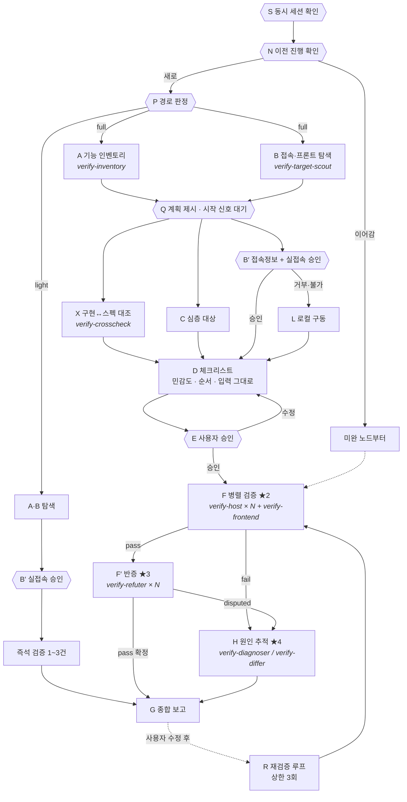

# verify-impl

기능 파악 → 접속 대상 확보 → **실접속 승인** → 체크리스트 + 민감도 → **사용자 승인** → 호스트별 병렬 실증 → 적대적 교차검증 → 보고.

## 팀 구성

팀장(이 skill)은 오케스트레이션만 한다. 실제 탐색과 실행은 팀원이 한다.

| 팀원 | 담당 | 왜 분리하나 |
|------|------|-------------|
| `verify-inventory` | A - 기능 인벤토리 | 코드를 대량으로 읽어도 팀장 컨텍스트에 안 쌓인다. |
| `verify-target-scout` | B - 접속 대상·프론트 탐색 | A와 독립이라 동시 실행 가능 |
| `verify-crosscheck` | X - 구현↔스펙 대조 | A·B 결과만 있으면 되고 C 와 병렬로 실행된다. |
| `verify-host` | F - 호스트 한 대 전담 검증 | 로그 수천 줄이 팀원에서 끝나고 팀장엔 JSON 만 온다. |
| `verify-frontend` | F - 프론트↔백엔드 연계 | 계약 불일치는 양쪽을 같이 봐야 잡힌다. |
| `verify-refuter` | F′ - 반증 전담 | 팀장과 분리돼야 확증 편향이 안 생긴다. |
| `verify-diagnoser` | H - fail 원인 추적 | 실패 하나를 깊게 파는 일이라 항목별로 나뉜다. |
| `verify-differ` | H - 호스트 간 차이 원인 | 같은 코드가 다르게 실행되는 건 환경 문제다. 대조가 전문 기술 |

팀원 정의는 `~/.claude/agents/verify-*.md` 에 있다.

**팀장이 직접 하는 것:** 사람과의 대화(B′ 접속 승인, E 체크리스트 승인), 판단(C 심층 대상, D 체크리스트·민감도), 종합(G).
**팀장이 하지 않는 것:** 코드 통독, SSH 접속, 검증 명령 실행, 반증.

## 절대 규칙

0. **"에러가 없다" 는 pass 가 아니다.** 관측·수집 계열 코드베이스에서 가장 흔한 실패는 예외가 아니라
   **조용히 틀린 값을 내는 무음 실패**다 (`references/silent-failure.md`). 기대한 동작의 흔적이 관측돼야 pass 다.
   소스 주석과 이름도 사실로 믿지 않는다 - 실측으로만 판정한다.
   그리고 **내가 손으로 실행한 결과는 운영에서 실행되는 결과가 아니다** (`references/context-trap.md`).
   내가 조용히 틀리는 방식은 따로 있다 - `references/misjudgment.md` 를 pass 적기 전에 본다.
1. **추정을 사실로 말하지 않는다.** "~일 것이다", "~로 보인다"로 판정하지 않는다. 실제로 붙어서 본 것, 실행한 명령의 출력, `file:line` 중 하나가 없으면 verdict는 `unknown`이다. 코드가 그렇게 쓰여 있다는 것과 그렇게 동작한다는 것은 다른 주장이다.
2. **실제 노드에 붙기 전에 반드시 묻는다.** 접속 자체가 승인 대상이다. 거부되면 로컬 구동(L)으로 간다.
3. **E 승인 없이 F로 넘어가지 않는다.** 체크리스트를 제시할 때 **민감 항목을 미리 짚어서** 함께 묻는다 - 사용자가 하나씩 찾아내게 하지 않는다.
4. **범위를 넘지 않는다.** 지시받은 대상 밖의 코드·파일·호스트·브랜치를 건드리지 않는다. 부수적으로 고칠 게 보이면 **보고만 하고 하지 않는다.**
5. **비밀번호·토큰은 세션 안에서만 기억한다.** 파일에 쓰지 않고, 출력에서는 마스킹한다.

## 실행 그래프

| # | 노드 | 담당 | 의존 | 병렬군 | 게이트(통과조건) |
|---|------|------|------|--------|------------------|
| S | **동시 세션 확인** | **팀장** | - | - | 다른 세션 없음 확인, 있으면 스냅샷 모드 |
| N | **이전 진행 확인 · 재개** | **팀장** | S | - | 진행 파일 있으면 이어서, 없으면 새로 |
| P | **경량/전체 경로 판정** | **팀장** | N | - | 경로 확정. 애매하면 한 줄 질문 |
| A | 기능 인벤토리 | `verify-inventory` | P | ★1 | 기능별 `file:line` 근거 |
| B | 접속 대상 · 프론트 탐색 | `verify-target-scout` | P | ★1 | 호스트 후보 + 프론트 유무 |
| X | 구현↔스펙 대조 | `verify-crosscheck` | A, B | ★1.5 | 미구현·미문서화·계약불일치 목록 |
| C | 심층 검토 대상 판정 | **팀장** | A | ★1.5 | 우선순위 + 이유 |
| Q | **계획 제시 · 시작 신호 대기** | **팀장** | A, B | - | 블로킹(full만). 시작 신호 전 실행 금지 |
| B′ | **접속 정보 질의 + 실접속 승인** | **팀장** | Q | - | 블로킹. 승인/거부 확정 |
| L | **로컬 구동** (실접속 거부·불가 시) | 팀장 | B′ | - | 헬스체크 통과해야 F 가능 |
| D | 체크리스트 + **민감도·순서** | **팀장** | X, C, B′\|L | - | 전원 도착까지 대기. 사용자가 말한 것을 그대로 씀 |
| E | **사용자 승인** (민감 항목 개별 확인) | **팀장** | D | - | 블로킹. 명시적 승인 |
| F | 실증 검증 | `verify-host` × 호스트<br>`verify-frontend` × 1 | E | ★2 | 항목별 verdict + evidence |
| F′ | 적대적 교차검증 | `verify-refuter` × pass 수 | F의 pass | ★3 | 반증 실패해야 최종 pass |
| H | **원인 추적** | `verify-diagnoser` × fail 수<br>`verify-differ` × 차이 항목 | F, F′ | ★4 | 원인 + 근거 + 수정안(실행 안 함) |
| R | **재검증 루프** | 팀장 → F 재호출 | 사용자 수정 후 | - | fail 0 또는 상한 3회 |
| G | 종합 보고 | **팀장** | F, F′, H | - | 전원 도착까지 대기 |

**P 가 `light` 면 A·B → 즉석 검증 → 보고 로 끝낸다.** 판정표 → `references/routing.md`
**팀장은 직접 검증하지 않는다.** 탐색·실행·반증·진단은 팀원에게 위임하고, 팀장은 사람과의 대화(P·B′·E), 판단(C·D), 종합(G)만 한다.
팀원은 컨텍스트가 격리돼 있어 로그 수천 줄을 읽어도 팀장에게는 정리된 결과만 올라온다.



★1 = A·B 동시 · ★2 = **호스트별** Agent 동시 · ★3 = pass 항목별 동시

---

## S. 동시 세션 확인

**시작 전에 다른 세션이 같은 프로젝트에 붙어 있는지 본다.**

```sh
~/.claude/skills/shared/scripts/session-guard.sh <repo> 10
```

| 결과 | 행동 |
|------|------|
| 없음 (exit 0) | 평소대로 진행 |
| 있음 (exit 1) | **스냅샷 모드**로 전환하고 사용자에게 알린다. |
| **확인 불가 (exit 2)** | 세션 기록을 못 찾은 것이지 세션이 없는 것이 아니다. **스냅샷 모드로 간다** |

스냅샷 모드에서는 원본을 오래 붙잡지 않는다. `snapshot.sh take` 로 떠서 그 위에서 A·X 분석을 하고,
패치·커밋 직전에 `snapshot.sh drift` 로 그 사이 바뀐 것을 확인한다.

검증은 대체로 읽기라 충돌이 적지만, **다음은 동시 세션이 있으면 하지 않는다**:
- `git add -A`, 브랜치 전환, `stash`, `reset --hard`
- 다른 세션이 편집 중인 파일 수정
- 그 세션이 쓰는 호스트의 서비스 재기동

절차와 판단 기준 → `../shared/references/concurrent-sessions.md`

## N. 이전 진행 확인 · 재개

**시작 전에 `.claude/verify-progress.md` 를 먼저 본다.**

| 상황 | 행동 |
|------|------|
| 파일 없음 | 새로 시작. P 로 간다. |
| 파일 있고 미완 노드 있음 | **어디까지 했는지 한 줄로 알리고** 그 지점부터 이어간다. |
| 파일 있고 전부 완료 | 이전 결과를 요약해 보여주고 "다시 돌릴까요, 실패 항목만 볼까요" 를 묻는다. |
| 사용자가 "어디까지 했냐" 를 물음 | 파일을 읽어 바로 답한다. 다시 실행하지 않는다. |

진행 파일은 **노드가 끝날 때마다 갱신한다.** 팀원이 돌아올 때마다가 아니라 노드 단위다.

```markdown
# 검증 진행  (갱신: 2026-08-26 10:40)
대상: <repo> · 경로: full · 환경: 사이트A(10.0.0.11)

| 노드 | 상태 | 결과 |
|------|------|------|
| A 인벤토리 | 완료 | 기능 18개 |
| B 접속탐색 | 완료 | 호스트 2대, 프론트 있음 |
| Q 계획승인 | 완료 | 승인됨 |
| E 체크리스트 | 완료 | 12항목 승인 (VF-04 위험 승인) |
| F 검증 | **진행중** | 10.0.0.11 완료 / 10.0.0.12 미완 |
| H 원인추적 | 대기 | |

## 항목별
| id | 10.0.0.11 | 10.0.0.12 |
|----|-----------|-----------|
| VF-01 | pass | - |

## 다음 할 일
10.0.0.12 의 VF-01~12 를 verify-host 로 실행
```

**비밀번호·토큰은 진행 파일에 쓰지 않는다.** 재개 시 다시 묻는다.
이 파일은 커밋하지 않는다 (`.gitignore` 대상).

## P. 경로 판정

**시작하자마자 판정한다.** 짧은 단발 확인에 전 과정을 다 실행하는 게 이 skill 의 가장 흔한 실패다.

- **전체 신호**(다중 요구 / "전부"·"전반적" / 대상 미특정 / 호스트 2개 이상 / 배포 동반 / 200자 초과) 가 **하나라도** 있으면 `full`
- 전체 신호가 없고 짧은 단발 요청이면 `light`
- 애매하면 **한 줄로 묻는다**: "이거 하나만 빠르게 확인할까요, 아니면 관련 기능 전체를 검증할까요?"

`light` 경로: A·B 동시 → 대상 1~3개 즉석 검증 → 보고. **E 승인은 생략하되 B′ 실접속 승인은 생략하지 않는다.**
`light` 중 상태 변경이 필요해지거나 항목이 5개를 넘으면 **full 로 승격하고 알린다.** 반대로 강등하지는 않는다.

판정표와 승격 규칙 → `references/routing.md`

## A·B. 탐색 [★1 - 한 메시지에서 동시 호출]

**팀장이 직접 읽지 않는다.** 아래 둘을 한 메시지에서 동시에 띄운다.

| 팀원 | subagent_type | 넘길 것 |
|------|---------------|---------|
| 기능 인벤토리 | `verify-inventory` | repo 경로, 사용자가 지목한 관심 영역 |
| 접속 대상 탐색 | `verify-target-scout` | repo 경로 |

둘 다 돌아올 때까지 다음으로 넘어가지 않는다. `verify-target-scout` 가 `.claude/verify-targets.md` 를 찾았으면 **호스트를 재질문하지 않는다.**
판정 기준 상세 → `references/discovery.md`

## Q. 계획 제시 · 시작 신호 대기 (full 경로만, 블로킹)

A·B 탐색까지는 읽기만이라 먼저 실행한다. **그 결과로 계획을 짧게 보여주고 시작 신호를 기다린다.**

> "야 잠깐만 내가 말한거 지금 바로 시작하지말고 내가 시작하라면해"

제시할 것 (길게 쓰지 않는다. 표 하나 분량):

- 파악한 기능 개수와 심층으로 볼 것 2~3개
- 검증할 호스트와 환경
- 대략 몇 개 항목을 만들 예정인지
- **되돌릴 수 없는 작업이 포함될 가능성**이 있으면 지금 미리 알린다.

그리고 **시작 신호를 기다린다.** "ㄱㄱ", "해", "진행해" 같은 신호가 오기 전에는 B′ 로 넘어가지 않는다.

사용자가 처음부터 "바로 진행해" 라고 했으면 Q 를 건너뛴다.
`light` 경로는 Q 가 없다.

## B′. 접속 정보 질의 + 실접속 승인 (블로킹)

**실제 노드에 붙는 것 자체를 먼저 묻는다.** 아래를 한 번에 묻고, 나눠서 여러 턴에 걸쳐 묻지 않는다:

- **실제 노드에 접속해서 검증할까요, 로컬에 띄워서 할까요?**
- (접속이면) 호스트·포트·계정, 점프 호스트 경유 여부
- 인증: SSH 키 경로 / 비밀번호 / 토큰
- 프론트가 있다면: 프론트 URL, 로그인 계정, 연계 검증 여부
- 건드리면 안 되는 것 (호스트·서비스·디렉터리)
- **어느 소스를 고치는 작업이고, 어느 노드는 건드리면 안 되는지**
- **VPN 이 소스 IP 를 바꿔 놓는지** - 해당될 때만 묻는다 (아래)

**검증 대상 노드 ≠ 수정 대상 소스.** 이걸 명시적으로 갈라 둔다.

> "node-a와 node-b에 직접수정을 가하진말고 app-manager를 고친후에"

검증하러 들어간 노드에서 직접 고치면 그 노드는 더 이상 검증 환경이 아니다. 다음 검증이 무의미해진다.
진단 중 원인을 찾아도 **소스를 고치는 것이지 노드를 고치는 게 아니다.** 노드는 배포로만 바뀐다.

**시크릿 취급:** 한 번 받으면 **세션 안에서 기억하고 다시 묻지 않는다.**
- 호스트·포트·계정·점프 경로 → `.claude/verify-targets.md`에 기록 (다음 세션에서 재사용)
- **비밀번호·토큰 값 → 파일에 쓰지 않는다.** 세션 컨텍스트에만 유지하고, 명령 출력·보고서에서는 `***`로 마스킹한다.

접속 거부 또는 도달 불가 → **L로 간다.** 코드만 읽고 끝내지 않는다.

### VPN 이 소스 IP 를 바꿔 놓는 경우

접속 대상이 **출발지 IP 로 허용 목록을 거는** 경우가 있다. VPN 이 default 라우트를 잡고 있으면
나가는 공인 IP 가 바뀌어 **방화벽이 조용히 버린다.** 거부 응답이 아니라 타임아웃으로 보여서
"장비가 죽었나" 로 오해하기 쉽다.

승인된 호스트마다 라우팅을 한 번 본다. 로컬 조회라 패킷이 나가지 않으므로 승인 전에 해도 된다.

```sh
ip route get <호스트IP>                  # 어느 인터페이스로 나가는가
ip -d link show <그 인터페이스> | sed -n 3p   # kind 가 wireguard/tun/ppp 면 터널
ip -4 route show default                 # 터널 밖 default 후보
```

**터널로 나가는 호스트가 하나도 없으면 묻지 않는다.** 있을 때만 B′ 질문 묶음에 한 줄 더 넣는다.

> `<호스트>` 가 `wg0`(WireGuard)로 나갑니다. 터널 밖 default 는 `enp7s0` 하나입니다.
> 접속이 실패하면 `enp7s0` 으로 1회 재시도할까요? 나가는 공인 IP 가 달라집니다.

| 상황 | 행동 |
|------|------|
| 승인받음 | F 실행 묶음에 `VH_BYPASS=<iface>` 를 **확정된 값으로** 실어 보낸다. |
| 승인 안 받음 | 넘기지 않는다. 실패하면 팀원이 `unknown` + 진단으로 올린다. |
| 터널 밖 default 후보가 2개 이상 | **내가 고르지 않는다.** 후보를 보여주고 어느 것인지 묻는다. |
| 후보가 없음 (터널이 유일한 default) | 우회 불가. 묻지 않고 그대로 간다. |

**우회를 자동으로 켜지 않는다.** 승인받은 것은 "이 경로로 나가는 나" 지 "다른 공인 IP 로 나가는 나" 가
아니다. 나가는 IP 가 다르면 접속 대상 입장에서 다른 신원이고, 어느 신원으로 붙은 검증인지 모르게 된다.

실패한 뒤에 켜고 싶어지면 팀원은 사람과 대화를 못 하므로 `unknown` 으로 올라온다.
팀장이 그 진단을 보고 물어본 뒤, 승인되면 **그 항목만** `R` 로 재실행한다.

## L. 로컬 구동 (폴백)

실접속 없이도 **실제로 띄워서** 검증한다. 정적 대조는 이것마저 불가능할 때의 마지막 수단이다.

1. 구동 방법을 탐지한다: `docker-compose*.yml` → `make` 타깃 → `go run` / `npm run dev` 순.
2. **띄우기 전에 묻는다** - 포트 점유와 리소스를 쓰기 때문이다. 필요한 외부 의존(DB/큐)이 있으면 함께 알린다.
3. 헬스체크가 통과해야 F로 간다. `scripts/health-wait.sh` 사용.
4. **미확인 항목이 하나라도 남아 있으면 내리지 않는다.** 내리는 순간 그 항목은 영영 `unknown` 이 된다.
   재현에 들어간 시간이 아무리 길어도 다시 띄우는 비용이 항상 더 크다.
5. 전부 판정이 끝났으면 내릴지 **물어본다.** 내가 정하지 않는다.

**"확인하고 정리해" 처럼 두 단계를 지시받았으면, 앞 단계가 실패한 채로 뒤 단계를 실행하지 않는다.**
확인에 실패했으면 환경을 유지한 채 실패했다고 알리고 지시를 기다린다.
정리는 확인이 끝났을 때의 후속 동작이지, 무조건 하는 동작이 아니다.
띄운 것을 내리는 것, VM 을 지우는 것, 컨테이너를 삭제하는 것 전부 해당한다.

상세 → `references/local-run.md`

## X. 구현↔스펙 대조 [★1.5 - C와 동시]

A·B 가 돌아오면 `verify-crosscheck` 를 띄운다. **C 와 동시에** 실행한다 (서로 독립).

넘길 것: `verify-inventory` 의 기능 표, `verify-target-scout` 이 찾은 스펙 파일 경로.

돌아오는 것: 스펙에만 있는 것 / 구현에만 있는 것 / 계약 불일치 / 검증 항목 제안.
**"구현됐는데 스펙에 없고 인증도 없는" 항목은 D 에서 우선순위를 높인다.** 외부 노출인데 계약이 없는 상태다.

스펙 파일이 없으면 X 는 건너뛴다.

## C. 심층 검토 대상 판정

우선순위: 인증·인가 → 상태 변경 → 외부 연동 경계 → 에러 경로 → 조회.
선정 이유를 반드시 한 줄 단다. 기준표 → `references/discovery.md#심층-대상-선정`

## D. 체크리스트 + 민감도 · 순서

### 입력 우선순위

**사용자가 준 것이 코드에서 뽑은 것보다 우선한다.** 사용자는 무엇이 맞는 상태인지 알고, 코드는 그렇지 않을 수 있다.

| 순위 | 입력 | 처리 |
|------|------|------|
| 1 | **사용자가 말한 기대 상태** | 그 문장을 그대로 판정기준으로 쓴다. 다시 해석하지 않는다. |
| 2 | **붙여넣은 curl** | 엔드포인트·헤더·인증 추출. **JWT 만료 먼저 확인** |
| 3 | **붙여넣은 에러 로그** | 이미 재현된 실패면 F 를 건너뛰고 **H 로 직행** |
| 4 | X 의 계약 불일치 | 미문서화 + 무인증은 우선순위 상향 |
| 5 | C 의 심층 대상 | 코드에서 도출 |

그대로 옮기는 규칙과 읽는 법 → `references/inputs.md`
사용자 기준과 코드 기준이 **충돌하면 E 에서 짚어 묻는다.** 임의로 한쪽을 고르지 않는다.

### 항목 형식

각 항목은 아래 칸을 전부 갖는다. 하나라도 비면 항목이 아니다.

```
id | 대상(file:line 또는 호스트:포트) | 방법 | 절차(복붙 가능한 명령) | 판정기준(관측 가능) | 기준출처 | 민감도
```

민감도는 `안전` / `주의` / `위험`. **내가 먼저 판정한다.** 사용자가 위험 항목을 찾아내게 하지 않는다.

**`기준출처` 는 "이 항목을 정상/비정상으로 가른 기준을 어디서 가져왔는가" 다.** 위 입력 우선순위와 짝이다.

| 표기 | 뜻 | 사용자가 봐야 하나 |
|------|-----|-------------------|
| `사용자` | 사용자가 말한 것을 그대로 옮겨 적었다. | 아니오 |
| `curl` | 붙여넣은 요청에서 뽑았다. | 아니오 |
| `로그` | 붙여넣은 에러 로그에서 뽑았다. | 아니오 |
| `문서` | openapi·README 등에 적힌 대로다. | 문서가 낡았을 수 있음 |
| `코드` | **아무도 말해준 적 없어서 내가 코드를 읽고 정했다** | **예 - 여기가 틀릴 수 있다** |

`코드` 출처 항목은 E 에서 **따로 뽑아 기준이 맞는지 묻는다.**

### 순서 의존

순서를 틀리면 되돌릴 수 없는 조합이 있다 (재설치+초기화, 배포+검증, 생성+정리...).
걸리면 `순서: VF-03 → VF-05` 로 명시하고 **그 항목들은 병렬군에 넣지 않는다.**

판정표 → `references/sensitivity.md` · 항목 설계 → `references/checklist.md` · 출력 형식 → `templates/checklist.md`

## E. 사용자 승인 (블로킹)

체크리스트를 표로 제시하고, **민감 항목은 따로 뽑아 개별로 묻는다**:

> 아래는 신경 쓰셔야 할 항목입니다:
> - VF-05는 `10.0.0.11`(운영)에서 **서비스를 재기동**합니다. 진행할까요?
> - VF-07은 DB에 **쓰기**가 발생합니다. 롤백 방법은 …입니다.
> - VF-09는 생성한 리소스가 남습니다. 정리할까요?

그리고 **`기준출처` 가 `코드` 인 항목을 따로 뽑아, 기준 자체가 맞는지 묻는다.**
민감 항목은 "해도 되나" 를 묻는 것이고, 이건 **"내가 정한 정상의 정의가 맞나"** 를 묻는 것이다. 성격이 다르다.

> 아래는 아무도 말해준 적 없어서 제가 코드를 읽고 기준을 정한 항목입니다.
> 제가 "정상" 을 잘못 잡았을 수 있습니다.
>
> **VF-04  GPU 이상징후 카드**
> - 정상으로 봄: `anomalySummary.xidErrors` 가 숫자
> - 문제로 봄: 필드 없음 / undefined
> - 출처: 백엔드 응답 클래스 `NodeGpuSummaryResponse.java:72`
> - → 이 기준이 맞습니까?
>
> **VF-09  GPU 텔레메트리 수집**
> - 정상으로 봄: `type=host` 데이터가 1건 이상
> - 출처: 코드
> - → passthrough 구성이면 **0건이 정상**일 수 있습니다. 어느 쪽입니까?

`코드` 출처가 하나도 없으면 이 절은 건너뛴다. 전부 사용자가 준 기준이면 물을 게 없다.

승인 전에는 어떤 검증 명령도 실행하지 않는다. 수정 요청이 오면 D로 돌아간다.

## F. 실증 검증 [★2 - 호스트별 팀원 동시 투입]

**호스트 하나 = `verify-host` 한 명.** 한 메시지에서 호스트 수만큼 동시에 띄운다.

각 팀원에게 넘길 것:
- 배정 호스트와 접속 정보 (호스트, 포트, 계정, 인증, 점프 경유 여부)
- **그 호스트에 해당하는** 승인된 체크리스트 항목 전부 (id, 대상, 방법, 절차, 판정기준)
- 승인된 상태 변경 항목이 무엇인지 명시 - 표시가 없으면 팀원은 실행하지 않는다.
- 건드리면 안 되는 것

각 팀원 반환:
```json
{"host":"10.0.0.11","reachable":true,
 "results":[{"id":"VF-01","verdict":"pass|fail|unknown","evidence":"출력 원문","cmd":"실행 명령","via":"direct|bypass:<iface>"}],
 "notes":["범위 밖 발견 사항"]}
```

전원이 결과를 낼 때까지 F′·G 로 가지 않는다.

프론트 항목이 있으면 **`verify-frontend` 를 같은 ★2 묶음으로 함께 띄운다.** 호스트 팀원들과 동시에 실행된다.
로컬 구동(L)으로 검증하는 경우엔 팀원을 호스트별로 나눌 게 없으므로 **`verify-host` 한 명에게 로컬 대상으로 전부 맡긴다.**

수단 우선순위(팀원이 따르는 규칙): SSH 원격 실행 → 서비스 상태·로그 → DB 직접 조회 → 배포 반영 대조 → 프론트 연계 → 정적 대조(최후, `(정적)` 표시 필수).
레시피 → `references/ssh.md` · 판정 규칙 → `references/verification.md`

**팀장이 하는 일:** 결과 취합, 호스트 간 차이 확인, F′ 대상(pass 항목) 추리기. 직접 SSH 하지 않는다.

## F′. 적대적 교차검증 [★3 - pass 항목별 팀원 동시 투입]

`pass` 가 나온 항목만 대상. **항목 하나 = `verify-refuter` 한 명.** 한 메시지에서 동시에 띄운다.

각 팀원에게 넘길 것: 항목의 id, 대상, 절차, 판정기준, 그리고 **pass 근거가 된 evidence**.

각 팀원 반환:
```json
{"id":"VF-01","refuted":true,"angle":"우연통과","reason":"...","suggested_criterion":"..."}
```

`refuted=true` → 최종 verdict 는 `pass` 가 아니라 `disputed`. 보고서에서 분리 표기한다.
팀원이 `suggested_criterion` 을 주면 G 의 "다음에 볼 것" 에 옮긴다.

pass 항목이 없으면 F′ 는 건너뛴다.

## H. 원인 추적 [★4 - fail·disputed 항목별 동시]

**fail 을 보고만 하고 끝내지 않는다.** 실제 요청은 거의 항상 "왜 안되는지 확인"까지다.

**H 진입 전에 `references/context-trap.md#3` 으로 "설계상 정상" 과 "선재 실패"(검증 전부터 깨져 있던 것) 를 먼저 배제한다.**
정상인데 원인을 파면 시간만 버린다.

| 상황 | 팀원 | 투입 단위 |
|------|------|-----------|
| 단일 호스트 fail, 또는 전 호스트 동일 fail | `verify-diagnoser` | 항목당 1명 |
| 호스트마다 결과가 갈림 (A=pass, B=fail) | `verify-differ` | 갈린 항목당 1명 |
| F′ 에서 `disputed` | `verify-diagnoser` | 항목당 1명 |

한 메시지에서 전부 동시에 띄운다.

**두 팀원 모두 고치지 않는다.** 원인과 수정안까지만 올린다. 고칠지는 사용자가 G 를 보고 결정한다.
범위 준수 규칙이 여기서도 적용된다 - 진단 중 발견한 다른 문제도 보고만 한다.

`confidence: low` 로 올라온 항목은 G 에서 **"원인 미확정"** 으로 분리 표기하고 무엇을 더 봐야 하는지 적는다.

## R. 재검증 루프

사용자가 수정한 뒤 "다시 확인해줘" 가 오면 **실패했던 항목만** F 로 다시 보낸다. 전체를 다시 실행하지 않는다.

- 대상: 직전 라운드의 `fail` + `disputed` + `unknown`
- **배포 반영을 먼저 확인한다.** 수정이 원격에 반영 안 된 채 재검증하면 같은 fail 이 또 나온다 (`md5sum`, 이미지 태그).
- 종료 조건: fail 0 **또는 3회 반복.** 3회에도 안 잡히면 멈추고 사용자에게 판단을 넘긴다.
- 라운드마다 무엇이 바뀌었는지 한 줄로 남긴다. 같은 자리를 맴도는 것을 사용자가 알아채야 한다.

pass 로 바뀐 항목은 F′ 반증을 **다시 거친다.** 수정 후 통과가 진짜인지는 별개 문제다.

## G. 종합 보고

`templates/report.md` 형식. 반드시 포함:
- 항목별 verdict 표 (**호스트별 열** - 사이트 간 차이가 보이게)
- **fail·disputed 의 원인과 수정안** (H 결과). `confidence: low` 는 "원인 미확정" 으로 분리
- R 을 돌았으면 라운드별로 무엇이 바뀌었는지
- pass의 증거 (명령 + 출력 발췌, 시크릿 마스킹)
- **검증하지 못한 것과 이유** - 비우지 않는다.
- **선재 실패와 신규 실패 구분** - 검증 전부터 깨져 있던 것을 섞지 않는다. 구분이 안 되면 그렇다고 적는다.
- **확인 안 된 경계 조건** - pass 항목마다 0/없음, N개, 빈 값, 권한, 타이밍, 환경 차이, 규모, 의존 장애를 대입해 짚는다 (`references/boundary.md`). 성공 직후 바로 오는 질문이라 먼저 던져 놓는다.
- **검증 중 발견했지만 범위 밖이라 손대지 않은 것** - 보고만

## 하지 말 것

- 실제 노드에 승인 없이 접속
- **승인 없이 다른 인터페이스로 우회 접속** (나가는 공인 IP 가 바뀌면 다른 신원이다)
- 체크리스트 승인 전 검증 실행
- 민감 항목을 표시 없이 섞어서 승인 요청
- **`코드` 출처 기준을 사용자 기준인 것처럼 섞어서 승인 요청** (내가 정한 것임을 밝힌다)
- 커밋 메시지를 "된다" 의 근거로 쓰기
- 추정으로 pass 판정 / `unknown`을 pass로 뭉개기
- 비밀번호·토큰을 파일에 기록하거나 출력에 노출
- 범위 밖 수정 (발견해도 보고만)
- `timeout` 없는 원격 명령
- 검증 못 한 항목을 보고서에서 조용히 빼기
- **미확인 항목을 남긴 채 검증 환경을 내리기** (VM·컨테이너·띄운 프로세스 전부)
- **앞 단계가 실패했는데 뒤 단계(정리·삭제)를 그대로 실행하기**
- **pass 만 보고하고 경계 조건을 안 짚기** (바로 다음 질문이 그것이다)
- 이미 아는 내용을 정리해서 산출물로 내놓기 (실질이 없으면 없다고 말한다)
- 확인 안 한 경계 조건을 "괜찮을 것" 으로 적기
- **"에러 없음" 을 근거로 pass 판정** (무음 실패를 통과시킨다)
- **계산해서 만든 값을 "실측" 이라고 적기** (뺄셈이 한 번이라도 들어가면 실측이 아니다)
- 사용자가 이상하다고 신고한 것을 **코드 논증으로 눌러 pass** (추론으로 관측을 기각하지 않는다)
- 고친 코드가 그 환경에서 **실제로 탔는지 안 보고** "고쳤다" 로 보고 (반영 확인과 별개다)
- 관측 안 한 최대치를 산술로 단정 (관측 범위를 같이 적는다)
- 사용자가 화면을 말했는데 **헤더·응답코드로 판정**
- 재현 경로를 안 묻고 코드에서 그럴듯한 경로를 찾아 원인으로 확정
- 소스 주석이나 이름을 근거로 판정하기 (실측으로만)
- 선재 실패를 신규 실패처럼 보고하기
- 수동 실행 결과로 판정하기 (권한·컨텍스트가 운영과 다르다)
- 동명이인 확인 없이 판정하기 (엉뚱한 서비스를 봤을 수 있다)
- 설계상 정상인 0건을 fail 로 올리고 원인 파기
- 간헐 실패를 한 번 보고 fail 로 단정하기 (2회 재시도로 가른다)
- **팀장이 직접 SSH 접속하거나 검증 명령을 실행하기** (팀원에게 위임한다)
- 팀원을 순차로 하나씩 띄우기 (★ 병렬군은 한 메시지에서 동시에)
- 팀원이 올린 JSON 을 검토 없이 그대로 보고서에 붙이기
- **짧은 단발 확인에 전 과정 다 실행하기** (P 에서 걸러라)
- **fail 을 원인 없이 보고만 하고 끝내기** (H 를 붙여라)
- 진단 팀원이 원격 상태를 고치기 (진단만 한다)
- R 에서 배포 반영 확인 없이 재검증 (같은 fail 이 또 나온다)
- R 을 3회 넘게 돌기
- **진행 상태를 안 남기고 긴 검증 시작하기** (끊기면 처음부터가 된다)
- full 경로에서 **계획 제시 없이 바로 실행** (Q 를 건너뛰지 마라)
- **검증 대상 노드에서 직접 수정하기** (소스를 고치고 배포로 반영한다)
- 만료된 JWT 로 검증하고 401 을 기능 실패로 판정하기
- 사용자가 준 기대 상태를 200 응답 같은 것으로 **바꿔서** 판정하기
- 순서 의존 항목을 병렬군에 넣기
- **동시 세션 확인 없이 시작하기** (다른 세션이 파일을 바꾸는 중일 수 있다)
